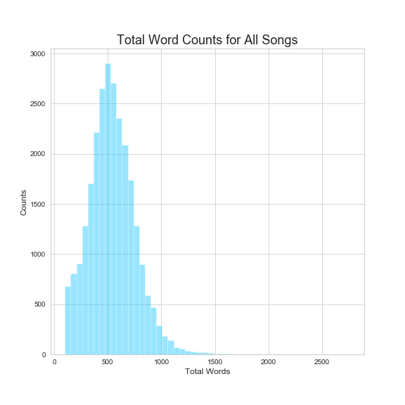
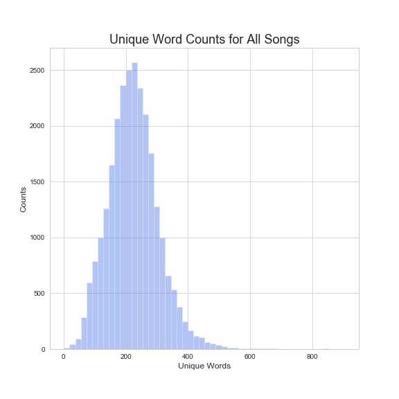
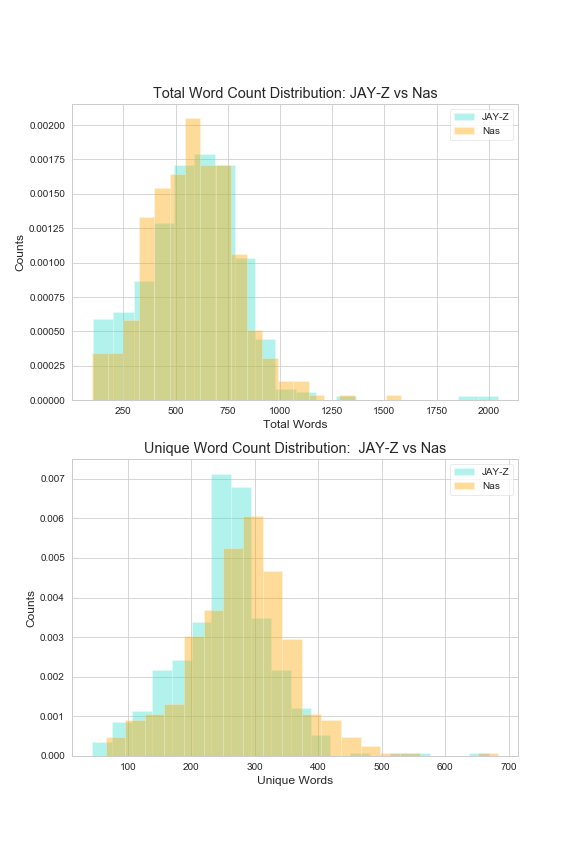
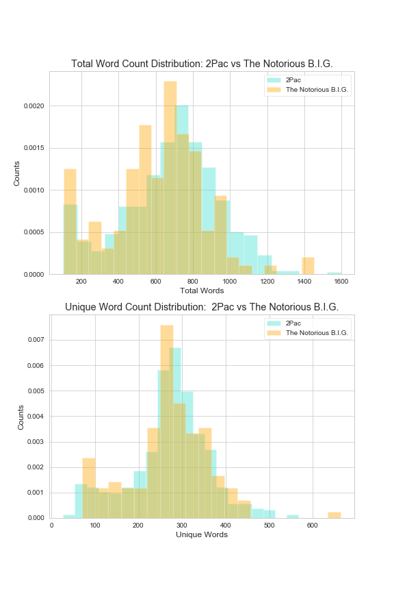
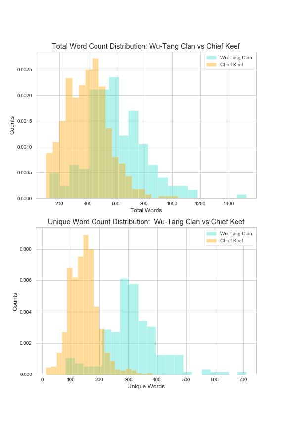
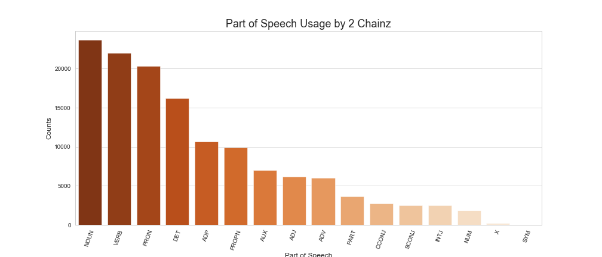
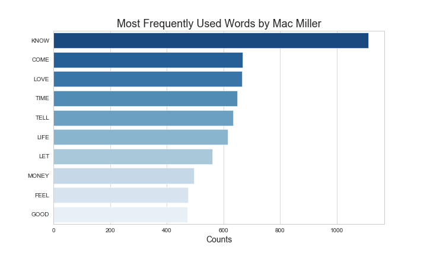
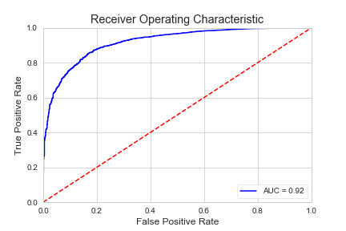
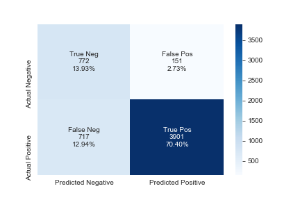

# Rap Lyrics: An Analysis of Songs Across the Years
The goal of this project was to explore rap lyrics, gathered from 100 rappers from the early 1980s to present day, using natural language processing. I explored both supervised and unsupervised learning, as well as a number of visuals.

# Background & Inspiration
I recently began learning about natural language processing and the many techniques data scientists have developed to make sense of text. A month ago, I completed a project where I scraped data from [Metacritic](https://www.metacritic.com) and explored how various genres had been reviewed historically based on the site's rating system (if interested, feel free to read about it [here](https://github.com/unclebrod/ReviewsByGenre)). I thought a natural extension of this project would be to look into my favorite genre, rap, and see what insights I could gain from its lyrics. I thought rap would be especially interesting because it relies on its artists producing lyrical content in much higher volumes than other genres.

# Goals
My goals for this project were to build my skills in natural language processing using each supervised learning, unsupervised learning, and data visualization. In supervised learning, I wanted to explore various models to see if I could create a predictor for when the song came out, using a binary classification of pre- and post-2000. In unsupervised learning, I hoped to explore non-negative matrix factorization to see what latent topics I could discover. I wanted to use data visualization to bring my analysis to life in creative ways.

# Data
All data was scraped from [Genius](https://www.genius.com) using [lyricsgenius](https://github.com/johnwmillr/LyricsGenius), a Python client for the Genius.com API. In its entirety, I collected information on 28,816 songs (this data includes artist name, song title, album, producer, release data, URL, and lyrics). I pulled all songs available from these artists on Genius. After working to sift through noise (including fake songs, incomplete snippets, live versions, interviews, social media postings, and excerpts), this was reduced to 26,188 songs. Most songs contained 400-600 words. When I created my supervised learning models, I used the songs for which I had release dates (18,470 in total). These songs were collected from 100 artists, ranging from early pioneers like Slick Rick, Run-DMC, and Public Enemy, to more recent artists like Drake, 2 Chainz, and Migos.

# Exploratation
Prior to any word processing, I explored word counts in lyrics by artists. What I found is that on average, most rap songs sit at around 500 words total and around 250 words that are unique.  

Expanding from this, I also compared artists on these word counts. For example, we can see that Jay-Z & Nas, former rivals, have very similar counts across all of their lyrics. Similarly, so do 2Pac and Biggie. On the other hand, we see that the collective Wu-Tang Clan are a bit more verbose than the minimalistic Chief Keef.  

I created a custom tokenizer using [SpaCy](https://spacy.io/), and in the process I looked into some of its capabilities. I made a histogram for the frequency at which 2 Chainz uses various parts of speech.  

Using the aforementioned tokenizer, I went through several artists' discographies and looked through their most used words. I looked at Mac Miller and Missy Elliott, who despite being stylistically different artists from different eras, shared a bit in common in terms of their vocabulary. Both used "know", "come', and "love" in abundance. Mac often spoke to "feel," "good", and "life," whereas Missy was very self-referential (and for good reason - in her peak she was a larger than life personaliy).  

# Supervised Learning
I created a binary classifier that would predict if a song was made in the year 2000 or earlier, or if it was made post-2000. In terms of song counts, 3018 songs were in the year 2000 or earlier, and 15385 were post-2000. My tokenizer was custom built using SpaCy's lemmatizing capabilities (stopwords included its standard words, ad-libs, vocalizations, and most curse words I could catch/remember), and vectorization & modeling was completed using Sci-Kit Learn. I tested may ways to deal with the class imbalance, including tweaking model parameters and using imbalanced-learn to undersample the majority class. In terms of scoring metrics, I placed a priority on precision, recall, and training speed. After testing models such as gradient boosting, logistic regression, and naive Bayes, the model that consistently performed best was a [Balanced Random Forest Classifer](https://imbalanced-learn.readthedocs.io/en/stable/generated/imblearn.ensemble.BalancedRandomForestClassifier.html) with 100 trees and a maximum deph of 10. It's cross-validated scores were a <2 second fit time, 84.5% accuracy, 95.9% precision, and 85.0% recall.  

I observed the results my model got wrong, and unsurprisingly most misses were songs from around 2000. Interestingly, 2Pac songs were disproportionately missed (he passed in '96). I'd wager that this is likely due either to the way 2Pac songs have been kept alive post-2000 through sampling or to his forward-thinking themes.

# Unsupervised Learning
I performed non-negative matrix factorization on each the pre- and post-2000 splits to see what type of themes machine learning could discover. Note that I did attempt to clean up bad language, but one should never underestimate how any expletives there are and the myriad ways they can be spelled.  

Notable are the first concepts in each, which grouped together words that are largely associated simply with living. In fact, I'd say this is what drives most rap. Its the genre's commitment to speak to the ups and downs associated with life that have always mesmerized me. We also see similar themes of love/girls, hustling, braggadocio, and street life. Two of the most prolific artists in the game, Snoop Dogg and Gucci Mane, got their own concepts presumably from their sheer volume both in solo works and in collaborations with others.

# Technologies
* Python (including Seaborn, Matplotlib, Pandas, Numpy, Scikit-learn, SpaCy, and Imbalanced-learn)
* Amazon EC2

# Looking Forward
I'd like to continue exploring the data I have collected in a number of different ways:

* Looking into creating a multi-class predictor for decades as opposed to pre/post-2000.
* Exploring other models that I'm currently not as familiar with, such as XGBoost, support vector machines, and neural networks (I'm especially interested in neural networks as I believe they could give me kind of specificity/accuracy I'd be interested in)
* Placing a gap in time between the two classes. I split on, and included, the year 2000, but I'd be interested in seeing if a gap more like 1975 - 1995 & 2000-2020 would yield better results
* Collecting more data from rappers prior to the 2000s. The bulk of my data came post-2000s, though this was for lack of trying. Current rappers are more prolific than ever. For reference, the people with the most songs in my dataset were Lil Wayne (1131), Gucci Mane (1127), and Chief Keef (792), and those with the fewest were Slick Rick (69), Heavy D (56), and MC Hammer (46) (Cardi B had 54 but she's just getting started).

# Acknowledgements
A big thanks to Dan Rupp, Juliana Duncan, Peter Galea, and Austin Penner, each of whom poured a lot of their time and energy in helping me complete this project. A special thanks, too, to [Genius](https://www.genius.com) which is where I received all data used for this project. The wrapper used to scrape my data, [lyricsgenius](https://github.com/johnwmillr/LyricsGenius), was created by [John Miller](https://github.com/johnwmillr).
